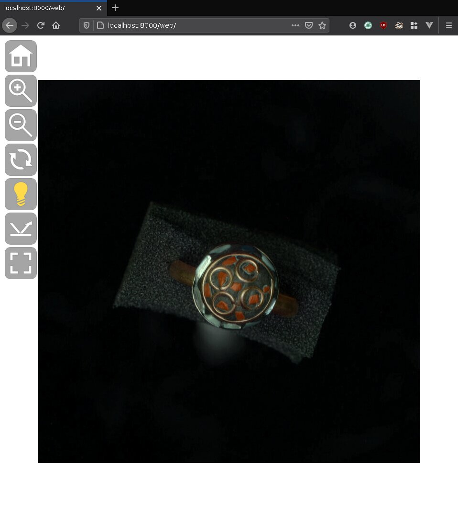

# Purpose

Docker container for building RTI models using [relight](https://github.com/cnr-isti-vclab/relight).



# Building

``` shell
docker build -t sepastian/relight-docker .
```

# Usage

This repository includes test images in `exmaples/ring`.
An RTI model has been build and placed in `web`.
To rebuid the model follow these steps.

Prerequisite: build the Docker container first, see _Building_ above.

Inside `examples/ring` are 64 images taken with an RTI dome and a corresponding `lights.lp` file, describing light positions.
Note that the number of images must match with the number of lines in `lights.lp`;
file names inside `lights.lp` must match with names of image files.

Next, use the container to build an RTI model from the images in `examples/ring`, save the results in `web`.

``` shell
$ docker run -it --rm \
  -v $(pwd)/examples/ring:/data \
  -v $(pwd)/web:/out \
  sepastian/relight-docker \
  relight-cli /data /out
Nsamples: 160000
Done in: 6927ms
```

This creates the following new files in `web`.

``` shell
$ ls web
info.json
materials.png
plane_0.jpg
plane_1.jpg
plane_2.jpg
```

Run an HTTP Server to view the resulting RTI model.

``` shell
# For example, using Python 3's built-in HTTP server.
python -m http.server
```

Open `http://localhost:8000` in a browser. Firefox in Linux may not be able to display the results, use Chrome instead.

# Credits

RTI viewer website based on the original [relight project](https://github.com/cnr-isti-vclab/relight).
Images in `examples/ring` produced by Nina Kunze, Uni Passau.
